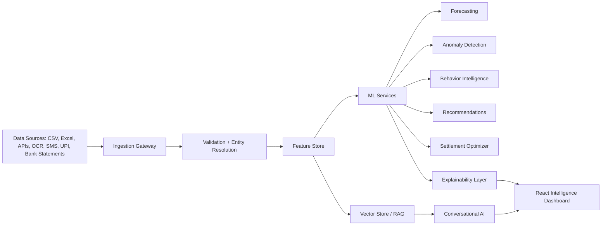

# Expense Intelligence & Financial Analytics Platform

## Product direction

The platform must evolve from generic CSV analytics into an AI fintech system with domain-specific expense intelligence. The key design rule is simple: no fake 100% accuracy, no generic AutoML claims, and no unexplained AI output. Every model output must include evidence, validation, uncertainty, and limitations.

## Target architecture



Recommended production stack:

| Layer | Stack |
|---|---|
| API | FastAPI, Pydantic, SQLAlchemy |
| Core DB | PostgreSQL |
| Document/raw data | S3-compatible object storage or MongoDB |
| Cache/jobs | Redis + Celery/RQ |
| Streaming | Kafka or Redpanda |
| Vector search | ChromaDB, FAISS, or pgvector |
| ML tracking | MLflow |
| Orchestration | Airflow or Prefect |
| Deployment | Docker + Kubernetes |
| Observability | OpenTelemetry, Prometheus, Grafana, Sentry |

## Implemented foundation in this repo

The first production-grade backend layer now exists under:

```text
backend/ml/expense_intelligence/
```

It exposes:

```http
GET /expense-intelligence/{job_id}
```

Current capabilities:

1. Expense-aware preprocessing
   - schema detection
   - amount/date/description/payer/category inference
   - category normalization
   - semantic duplicate keys
   - audit logs
   - confidence scoring

2. Feature engineering
   - daily spend
   - rolling averages
   - trend velocity
   - category spend concentration
   - payer contribution ratios
   - weekend behavior
   - volatility score

3. Forecasting
   - time-ordered validation split
   - Random Forest time-series baseline
   - MAE, RMSE, MAPE
   - 30-day forecast
   - explicit limitations

4. Anomaly detection
   - Isolation Forest
   - category-relative spend ratios
   - z-score reasoning
   - human-readable anomaly explanations

5. Settlement optimization
   - net-balance minimization
   - reduced settlement transactions
   - payer balance diagnostics

6. Recommendations
   - category budget optimization
   - weekend guardrails
   - anomaly review
   - forecast-based burn-rate planning

## Next implementation phases

### Phase A — Productize the intelligence dashboard

Add a React page:

```text
/intelligence/:jobId
```

Panels:

- Financial health summary
- Forecast chart
- Anomaly table with explanations
- Category concentration
- Payer contribution graph
- Settlement optimizer
- Recommendations

Use Plotly or ECharts rather than static Matplotlib images.

### Phase B — NLP and conversational analytics

Replace the temporary chat fallback with a real query planner:

1. Parse natural language intent.
2. Retrieve relevant transaction slices.
3. Run deterministic calculations where possible.
4. Use LLM only for explanation synthesis.
5. Return SQL/pandas calculation trace for trust.

Example:

> "Show alcohol expenses involving Vedant and Sidd last month"

Should compile into:

- category filter: alcohol
- participant filter: Vedant/Sidd
- time filter: previous month
- output: table + summary + confidence

### Phase C — Proper forecasting service

Add model registry:

- baseline seasonal naive
- ARIMA/SARIMAX
- Prophet-compatible model where available
- gradient boosting baseline
- temporal transformer only when enough data exists

Always compare against baseline. Never promote a model unless it beats the baseline on time-ordered validation.

### Phase D — Explainability and governance

For every AI result store:

- input data version
- feature version
- model version
- validation metrics
- explanation payload
- confidence
- audit trail

### Phase E — Enterprise scale

Move long-running jobs out of FastAPI background tasks:

- FastAPI handles requests
- Redis/Celery runs analysis jobs
- PostgreSQL stores metadata
- object storage stores uploads/reports
- MLflow tracks experiments
- Kafka/Redpanda handles real-time transaction streams

## Non-negotiable quality rules

- No formula-derived target leakage.
- No random train/test split for time-series forecasting.
- No 100% accuracy badges.
- No unvalidated recommendations.
- No LLM-only financial calculations.
- No hidden model failures.
- Every prediction must expose uncertainty and limitations.

